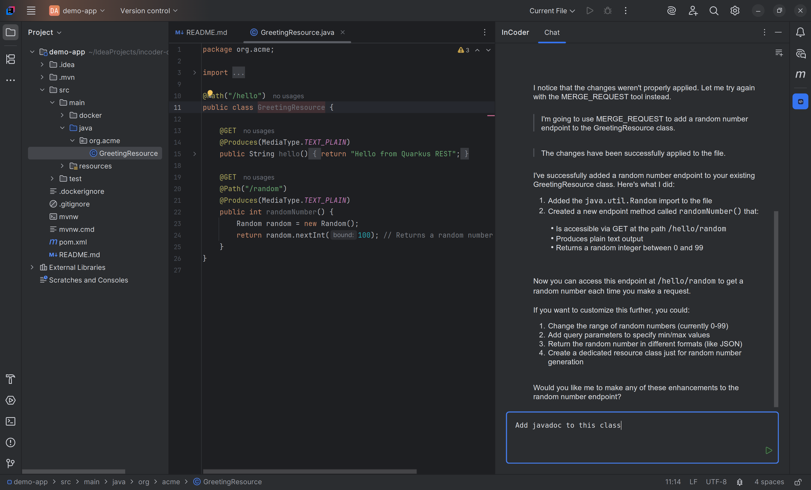
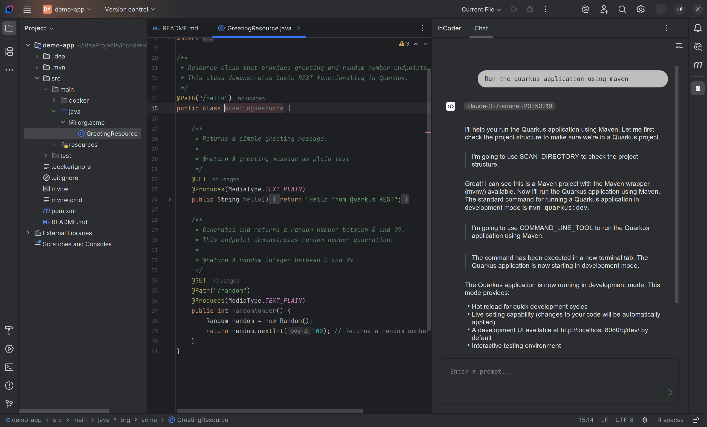
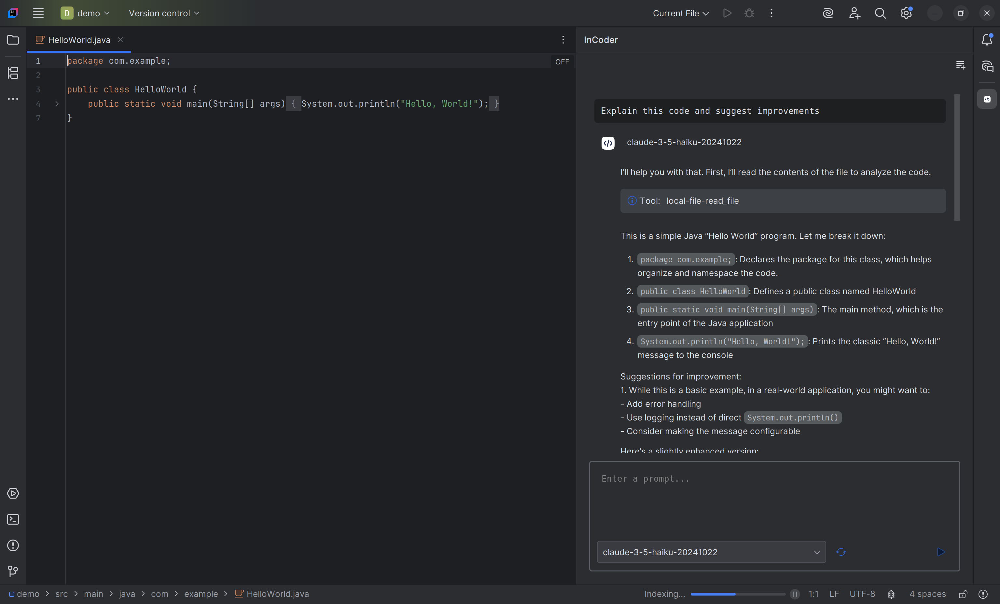
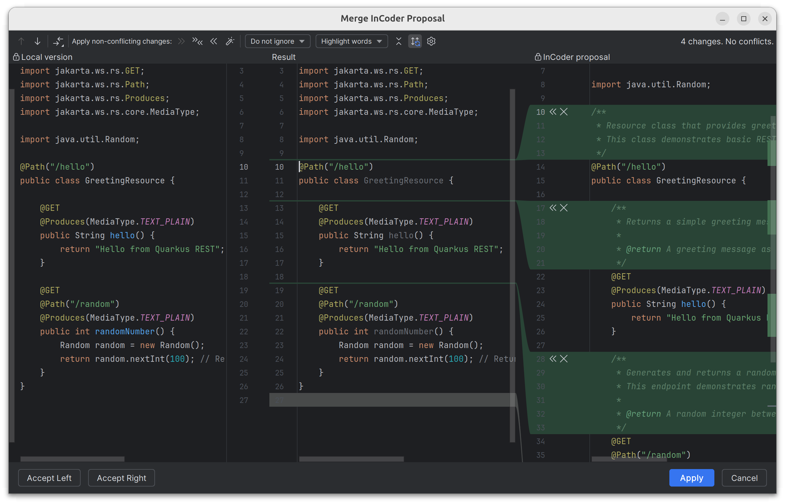
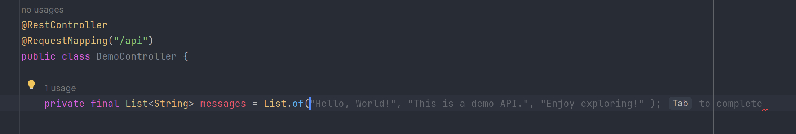

# InCoder: An LLM-Powered Plugin for JetBrains IDEs

[![jetbrains marketplace badge]][jetbrains marketplace link]
[![latest release badge]][latest release link]
[![latest tag badge]][latest tag link]
[![CI checks on main badge]][CI checks on main link]
[![latest commit to main badge]][latest commit to main link]
[![license badge]][license link]
[![paypal badge]][paypal link]

<!-- Plugin description -->
**InCoder** is a powerful plugin designed for JetBrains IDEs, including IntelliJ IDEA, PyCharm, and others in the JetBrains ecosystem.
It seamlessly integrates advanced Large Language Models (LLMs) into your development workflow, providing you with code generation, understanding, completion, and intelligent action capabilities, all directly within your favorite IDE.
<!-- Plugin description end -->

  
  

---

## Key Features

### 1. **Interactive Chat for Code Assistance**

  
  

- A dedicated **tool window** appears on the right panel of the IDE after installing the plugin.
- Interact with an LLM that now offers powerful autonomous capabilities:
  - **Generate code snippets** or solve coding challenges.
  - **Understand code** by analyzing the file or specific lines you're viewing.
  - **Autonomous Project Interaction**:
  	- Create new files and directories directly within your project structure
    - Navigate through project files and folders
    - Propose and apply code changes with intelligent context-aware suggestions
  - Get contextual suggestions and explanations based on the active file you're working on, as the LLM has access to the current code.
- **Advanced Tools**:
    - File creation: instantly generate new source files, test cases, or configuration files
    - Project navigation: quickly locate and open relevant files
    - Command line execution: give to the LLM the possibility to execute command lines after human approval.
      

        
      

    - Merge request and Patch generation: suggest and implement code improvements, extract methods, and optimize existing code

### 2. **Inline Code Completion**

  

- **Real-time suggestions** while you type in the editor.
- Press **Tab** to accept the suggested code and insert it directly into your file.
- Accelerate your coding workflow with intelligent autocompletion that understands the context of your project.

### 3. **Support for Multiple LLM Providers**
- InCoder supports **multiple LLM providers**, giving you flexibility and choice:
  - **Ollama**: Utilize models running locally on your machine to preserve privacy.
  - **OpenAI**: Access advanced cloud-based LLMs for high-quality suggestions and assistance.
  - **Anthropic**: Integrate with this leading LLM provider for ethical and powerful AI capabilities.
- All providers can be easily **configured** through the plugin's settings, allowing you to choose the one that best fits your needs.

### 4. **Privacy-Focused Local LLM Support**
- By using **Ollama**, InCoder enables local LLM inference directly on your computer.
- Keeps sensitive project data private and ensures compliance with internal security policies.
- Ideal for developers who value privacy and want to avoid sending data to external servers.

## Settings
The plugin is highly customizable through the **InCoder Settings** panel in your IDE. Access it via the settings/preferences menu under the section **InCoder**. 
Configuration is divided into three main subsections:

- **Chat**: Configure settings for the interactive chat window, such as history retention and UI preferences.
- **Inline**: Enable or disable inline code completion and customize the behavior (e.g., auto-suggestions, Tab behavior).
- **Server**: Set up your preferred LLM provider.

---

## Benefits of Using InCoder
- **Boost productivity**: Generate boilerplate code, debug faster, and understand unfamiliar codebases more quickly.
- **Enhanced contextual understanding**: The LLM has access to your active file, ensuring accurate and relevant suggestions tailored to your project.
- **Customizable and flexible**: Easily switch between LLM providers to adapt to your workflow or organizational requirements.
- **Seamless integration**: Designed specifically for JetBrains IDEs, ensuring an intuitive and native user experience.

## Experimental Features
- **Inline code completion** is currently experimental but highly promising for real-time code assistance and efficiency. Feedback is welcome to improve this feature further.

## Supported JetBrains IDEs
While InCoder is primarily tested on **IntelliJ IDEA** and **PyCharm**, it is compatible with most JetBrains IDEs, making it a versatile choice for developers working in diverse environments.

---

## Contribution
Contributions are welcome! If you'd like to help improve InCoder, follow these steps:
1. Fork the repository.
2. Create a new branch for your feature or bug fix.
3. Commit your changes and submit a pull request.
4. Open **issues** for suggestions, bug reports, or enhancements.

We follow a standard GitHub workflow, so feel free to contribute as you'd like!

---

## License
This project is licensed under the **Apache License**.
See the [LICENSE](LICENSE) file for more details.

---

## Support the Project

If you find this project helpful and would like to support its development, consider buying me a coffee!
Your donations will help keep the project alive and improve it over time.

[![paypal badge]][paypal link]

Thank you for your support! It means a lot and helps me dedicate more time to improving the project. 🙏

---

Empower your coding experience with **InCoder** and unlock the full potential of AI-driven development assistance. 
Whether you're generating code, understanding complex algorithms, or seeking intelligent completions, InCoder is here to make your workflow smarter, faster, and more secure.

[jetbrains marketplace badge]: https://badgen.net/badge/JetBrains/marketplace/orange
[jetbrains marketplace link]: https://plugins.jetbrains.com/plugin/26037-incoder

[latest release badge]: https://badgen.net/github/release/damiano1996/incoder-plugin?icon=github
[latest release link]: https://github.com/damiano1996/incoder-plugin/releases/latest

[latest tag badge]: https://badgen.net/github/tag/damiano1996/incoder-plugin?icon=github
[latest tag link]: https://github.com/damiano1996/incoder-plugin/tags

[CI checks on main badge]: https://badgen.net/github/checks/damiano1996/incoder-plugin/main?label=CI%20status%20on%20main&cache=900&icon=github
[CI checks on main link]: https://github.com/damiano1996/incoder-plugin/agents?query=branch%3Amain

[latest commit to main badge]: https://badgen.net/github/last-commit/damiano1996/incoder-plugin/main?icon=github
[latest commit to main link]: https://github.com/damiano1996/incoder-plugin/commits/main

[license badge]: https://badgen.net/github/license/damiano1996/incoder-plugin
[license link]: https://github.com/damiano1996/incoder-plugin/blob/main/LICENSE

[paypal badge]: https://badgen.net/badge/PayPal/donate/blue
[paypal link]: https://www.paypal.com/donate/?hosted_button_id=WB3T45XNXGNYU