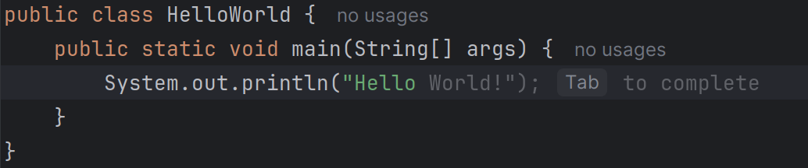

# InCoder: An LLM-Powered Plugin for JetBrains IDEs

[![jetbrains marketplace badge]][jetbrains marketplace link]
[![youtube badge]][youtube link]
[![paypal badge]][paypal link]

[![latest release badge]][latest release link]
[![latest tag badge]][latest tag link]
[![CI checks on main badge]][CI checks on main link]
[![latest commit to main badge]][latest commit to main link]
[![license badge]][license link]

<!-- Plugin description -->
**InCoder** is a powerful plugin designed for JetBrains IDEs, including IntelliJ IDEA, PyCharm, and others in the JetBrains ecosystem.
It seamlessly integrates advanced Large Language Models (LLMs) into your development workflow, providing you with code generation, understanding, completion, and intelligent action capabilities, all directly within your favorite IDE.
<!-- Plugin description end -->

---

Here you go — concise and punchy, ready to paste:

---

## Key Features

### Interactive Chat for Code Assistance

  

  

#### Local Tools

* **Command line tool:** Runs shell commands in the **IntelliJ integrated terminal** *after explicit confirmation*.

  

* **Editor tool:** Creates **unified diff patches** and opens a **merge dialog** (visual diff) for review before applying.

  

* **File tool:**

    * **Scan directory**: lists files and folders.
    * **Read file**: returns content with **line numbers** (great for precise edits).
    * **Create empty file**: safely creates files only if they don’t exist and **refreshes the project** view.

#### MCP Tools

  

* InCoder can **attach to MCP servers** and surface their tools directly in chat.
* Tools are **discovered dynamically** (e.g., filesystem, editor, shell, git from compatible servers).

### Inline Code Completion

  

* **Real-time inline suggestions** (ghost text) while you type.
* Press **Tab** to accept; stays out of your way when you don’t need it.
* Context-aware across the current buffer; configurable in settings (feature is evolving fast).

---

## Supported JetBrains IDEs
While InCoder is primarily tested on **IntelliJ IDEA** and **PyCharm**, it is compatible with most JetBrains IDEs, making it a versatile choice for developers working in diverse environments.

---

## Contribution
Contributions are welcome! If you'd like to help improve InCoder, follow these steps:
1. Fork the repository.
2. Create a new branch for your feature or bug fix.
3. Commit your changes and submit a pull request.
4. Open **issues** for suggestions, bug reports, or enhancements.

We follow a standard GitHub workflow, so feel free to contribute as you'd like!

---

## License
This project is licensed under the **Apache License**.
See the [LICENSE](LICENSE) file for more details.

---

## Support the Project

If you find this project helpful and would like to support its development, consider buying me a coffee!
Your donations will help keep the project alive and improve it over time.

[![paypal badge]][paypal link]

Thank you for your support! It means a lot and helps me dedicate more time to improving the project. 🙏

---

Empower your coding experience with **InCoder** and unlock the full potential of AI-driven development assistance. 
Whether you're generating code, understanding complex algorithms, or seeking intelligent completions, InCoder is here to make your workflow smarter, faster, and more secure.

[jetbrains marketplace badge]: https://badgen.net/badge/JetBrains/marketplace/orange
[jetbrains marketplace link]: https://plugins.jetbrains.com/plugin/26037-incoder

[youtube badge]: https://badgen.net/badge/YouTube/watch%20demo/ff0000?icon=youtube
[youtube link]: https://www.youtube.com/watch?v=sW1ajzRwFaQ

[latest release badge]: https://badgen.net/github/release/damiano1996/incoder-plugin?icon=github
[latest release link]: https://github.com/damiano1996/incoder-plugin/releases/latest

[latest tag badge]: https://badgen.net/github/tag/damiano1996/incoder-plugin?icon=github
[latest tag link]: https://github.com/damiano1996/incoder-plugin/tags

[CI checks on main badge]: https://badgen.net/github/checks/damiano1996/incoder-plugin/main?label=CI%20status%20on%20main&cache=900&icon=github
[CI checks on main link]: https://github.com/damiano1996/incoder-plugin/agents?query=branch%3Amain

[latest commit to main badge]: https://badgen.net/github/last-commit/damiano1996/incoder-plugin/main?icon=github
[latest commit to main link]: https://github.com/damiano1996/incoder-plugin/commits/main

[license badge]: https://badgen.net/github/license/damiano1996/incoder-plugin
[license link]: https://github.com/damiano1996/incoder-plugin/blob/main/LICENSE

[paypal badge]: https://badgen.net/badge/PayPal/donate/blue
[paypal link]: https://www.paypal.com/donate/?hosted_button_id=WB3T45XNXGNYU